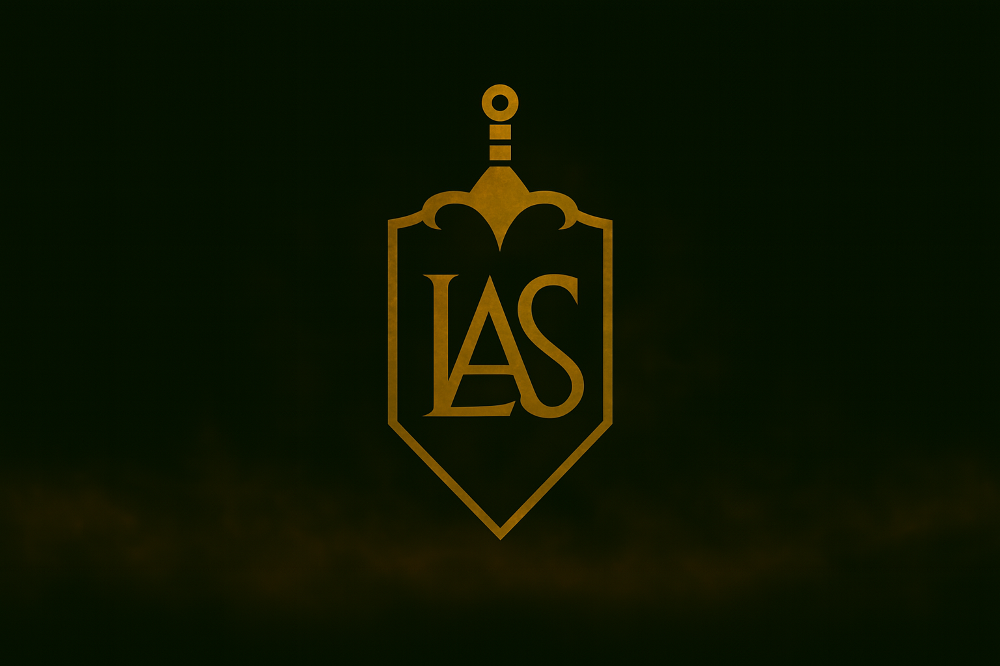

/* Reset básico */
* {
  margin: 0;
  padding: 0;
  box-sizing: border-box;
}

body {
  font-family: 'Segoe UI', Tahoma, Geneva, Verdana, sans-serif;
  line-height: 1.6;
  background-color: #f9f9f9;
  color: #333;
}

/* Header */
/*header {
  background-color: #1e1e1e;
  color: #fff;
  padding: 1rem;
  text-align: center;
}*/

/*nav h2 {
  font-size: 1.4rem;
  letter-spacing: 1px;
}*/

#banner {
  width: 100vw;               /* Largura total da viewport */
  height: -50px;              /* Altura fixa do banner */
  min-height: 10px;          /* Altura mínima para garantir visibilidade */
  background-image: url("imagens_front_blog_le/so_logo_blog_le.png");
  background-size: cover;         /* Preenche o espaço mantendo proporção */
  background-position: center;/* Centraliza com leve deslocamento vertical */
  background-repeat: no-repeat;   /* Evita repetição da imagem */
  display: flex;                  /* Permite centralizar conteúdo interno */
  align-items: center;           /* Alinha verticalmente */
  justify-content: center;       /* Alinha horizontalmente */
  position: relative;            /* Permite sobreposição futura */
  color: white;                  /* Cor padrão para texto sobre o banner */
  text-align: center;            /* Centraliza texto */
}

/* Parte 1: Título em Flexbox */
.titulo-flex {
  display: flex;
  justify-content: center;
  align-items: center;
  padding: 2rem;
  background-color: #eaeaea;
}

.titulo-flex h1 {
  font-size: 2rem;
  color: #222;
}

/* Parte 2: Conteúdo em CSS Grid */
.conteudo-grid {
  display: grid;
  grid-template-columns: 1fr 3fr 1fr;
  gap: 1rem;
  padding: 2rem;
}

.ads-esquerda,
.ads-direita {
  background-color: #f0f0f0;
  padding: 1rem;
  font-size: 0.9rem;
  color: #666;
}

.conteudo-principal {
  background-color: #fff;
  padding: 2rem;
  border-radius: 8px;
  box-shadow: 0 0 10px rgba(0,0,0,0.05);
}

/* Parte 3: Imagem em Flexbox */
.imagem-flex {
  display: flex;
  justify-content: center;
  align-items: center;
  padding: 2.5rem;
  background-color: #eaeaea;
}

.imagem-flex img {
  width: 100%;
  height: auto;
  max-height: 500px;
  object-fit: center top;
  border-radius: 10px;
  box-shadow: 0 4px 12px rgba(0,0,0,0.1);
}

/* ======== Rodapé ======== */
.footer {
  text-align: center; /* Centraliza o conteúdo do rodapé */
  padding: 20px; /* Espaçamento interno */
  background-color: #3e3d3d; /* Fundo cinza escuro */
  font-size: 14px; /* Texto menor */
  color: #eceef3; /* Texto em tom claro para contraste */
}

/* ======== Container "Powered by" ======== */
.powered-by {
  display: flex; /* Layout flexível */
  align-items: center; /* Alinha verticalmente ao centro */
  justify-content: center; /* Centraliza horizontalmente */
  gap: 10px; /* Espaço entre os elementos */
  margin-top: 10px; /* Espaço acima do bloco */
}

/* ======== Logo suave ======== */
.logo-suave {
  height: 24px; /* Altura fixa do logo */
  opacity: 0.6; /* Deixa o logo mais suave/menos chamativo */
  transition: opacity 0.3s ease; /* Transição suave ao mudar opacidade */
}

/* ======== Efeito hover no logo ======== */
.logo-suave:hover {
  opacity: 1; /* Destaca o logo ao passar o mouse */
}

<!DOCTYPE html>
<html lang="pt-BR">
<head>
  <meta charset="UTF-8">
  <meta name="viewport" content="width=device-width, initial-scale=1.0">
  <title>Blog Dr. Leandro Alves de Souza</title>
  <link rel="stylesheet" href="blog_le_front\blog_le_styles.css">
</head>
<body>

  <header id="banner">
    
  </header>

  <!-- Main -->
  <main>

    <!-- Parte 1: Título em Flexbox -->
    <section class="titulo-flex">
      <h1>Descrição do Caso</h1>
    </section>

    <!-- Parte 2: Conteúdo em CSS Grid -->
    <section class="conteudo-grid">
      <aside class="ads-esquerda">Anúncios</aside>
      <article class="conteudo-principal">
        
Conteúdo principal do caso, narrado com leveza, suspense e técnica.

        <!-- Aqui virão os links individuais para cada caso -->
      </article>
      <aside class="ads-direita">Parcerias</aside>
    </section>

    <!-- Parte 3: Imagem em Flexbox -->
    <section class="imagem-flex">
      
    </section>

  </main>

  <!-- Rodapé -->
    <footer class="footer">
    
© 2025 Blog Dr. Leandro Alves de Souza - Todos os direitos reservados

    

        
        © Equipe Powered By HopeUp 7.DEV
    

    </footer>

</body>
</html>
